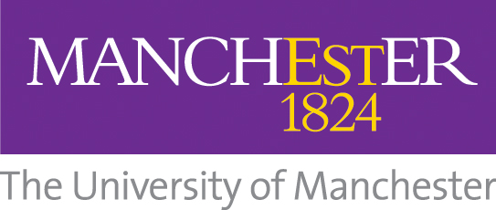

<!---
Copyright 2024 The Health Research From Home Team at University of Manchester. All rights reserved.

Licensed under the Apache License, Version 2.0 (the "License");
you may not use this file except in compliance with the License.
You may obtain a copy of the License at

    http://www.apache.org/licenses/LICENSE-2.0

Unless required by applicable law or agreed to in writing, software
distributed under the License is distributed on an "AS IS" BASIS,
WITHOUT WARRANTIES OR CONDITIONS OF ANY KIND, either express or implied.
See the License for the specific language governing permissions and
limitations under the License.
-->
<h1 align="center">
    
Health Research From Home

  
  
   
   

</h1>

Creating a new UK environment to advance population health research using smartphones and wearables. Developing and spreading best practice, including linkage.

## Who are we?
The Health Research from Home partnership is on a mission to improve the lives of people living with long-term health conditions. 
We’re going to make the most of the data held in smartphones and wearables turning that data into world leading health research and helping you to do the same. So that together, with patients at the heart of everything we do, we can transform health outcomes for everyone.
To find out more visit: www.tinyurl.com/healthresearchfromhome

## Who are the Health Research from Home Partners?
It’s going to take the brightest minds in health, academia and technology to deliver our mission. Led by the University of Manchester and Professor Will Dixon, our partnership also includes:

    

## GitHub
Our GitHib page is an evolving tool for those interested in conducting health research using smartphones and wearables.
On this page you’ll find links to relevant and interesting resources useful to your research.
If you’d like to suggest documents we can include on this list, please email hrfh@manchester.ac.uk.

## Publications and Articles

1. **Abdulkareem, M. and Petersen, S.E.** 2021. The promise of AI in detection, diagnosis, and epidemiology for combating COVID-19: beyond the hype. Frontiers in Artificial Intelligence, 4, p.652669. [Read Article](https://www.frontiersin.org/journals/artificial-intelligence/articles/10.3389/frai.2021.652669/full)
2. **Lim, Z.K., Connie, T., Ong Michael Goh, K. and Saedon, N.I.** 2024, Fall Risk Prediction Using Temporal Gait Features and Machine Learning Approaches. Frontiers in Artificial Intelligence, 7, p.1425713. [Read Article](https://www.frontiersin.org/journals/artificial-intelligence/articles/10.3389/frai.2024.1425713/abstract)
3. **Busch, F., Kather, J.N., Johner, C., Moser, M., Truhn, D., Adams, L.C. and Bressem, K.K.** 2024. Navigating the European Union Artificial Intelligence Act for Healthcare. npj Digital Medicine, 7(1), p.210. [Read Article](https://www.nature.com/articles/s41746-024-01213-6)
4. **Liang, W., Zhang, Y., Cao, H., Wang, B., Ding, D.Y., Yang, X., Vodrahalli, K., He, S., Smith, D.S., Yin, Y. and McFarland, D.A.** 2024. Can large language models provide useful feedback on research papers? A large-scale empirical analysis. NEJM AI, 1(8), p.AIoa2400196. [Read Article](https://ai.nejm.org/doi/abs/10.1056/AIoa2400196)
5. **Cox Jr, L.A.** 2024. An AI assistant to help review and improve causal reasoning in epidemiological documents. Global Epidemiology, 7, p.100130. [Read Article](https://www.sciencedirect.com/science/article/pii/S2590113323000330)
6. **Reis, M., Reis, F. and Kunde, W.** 2024. Influence of believed AI involvement on the perception of digital medical advice. Nature Medicine, pp.1-3. [Read Article](https://www.nature.com/articles/s41591-024-03180-7)
7. "The coalition for health AI have released a draft framework outlining standards for the safe deployment of AI in healthcare" [Read Article](https://chai.org/wp-content/uploads/2024/06/CHAI-Assurance-Standards-Guide-6-26-2024.pdf)
8. **McGagh, D., Song, K., Yuan, H., Creagh, A.P., Fenton, S., Ng, W.F., Goldsack, J.C., Dixon, W.G., Doherty, A. and Coates, L.C.** 2024. Digital health technologies to strengthen patient-centred outcome assessment in clinical trials in inflammatory arthritis. The Lancet Rheumatology. [Read Article](https://www.thelancet.com/journals/lanrhe/article/PIIS2665-9913(24)00186-3/fulltext)
9. **Louise, L. and Annette, B.** 2019. Drawing straight lines along blurred boundaries: qualitative research, patient and public involvement in medical research, co-production and co-design. Policy Press, 15(3), pp.409–421. [Read Article](https://bristoluniversitypressdigital.com/view/journals/evp/15/3/article-p409.xml#:~:text=In%20this%20paper%20we%20seek%20to%20contribute%20to)
10. "Briefing notes for researchers - public involvement in NHS, health and social care research" [Read Article](https://www.nihr.ac.uk/briefing-notes-researchers-public-involvement-nhs-health-and-social-care-research#:~:text=Involvement.%20NIHR%20defines%20public%20involvement%20in%20research%20as)

## Find out more
Email hrfh@manchester.ac.uk to find out more about Health Research from Home.
