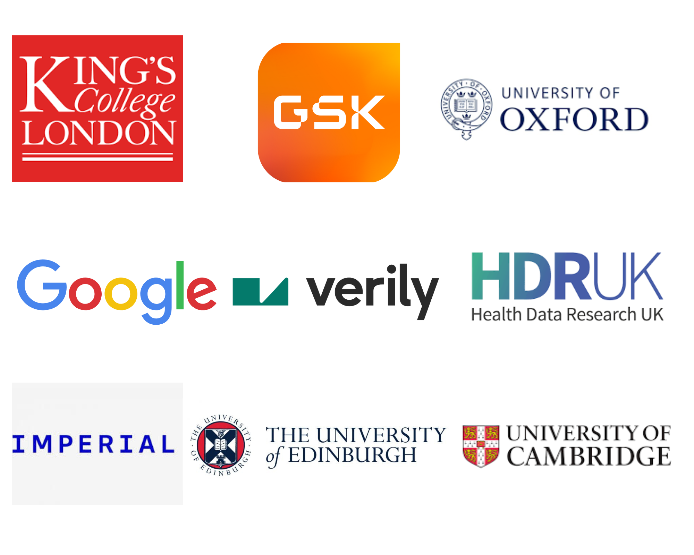

<!---
Copyright 2024 The Health Research From Home Team at University of Manchester. All rights reserved.

Licensed under the Apache License, Version 2.0 (the "License");
you may not use this file except in compliance with the License.
You may obtain a copy of the License at

    http://www.apache.org/licenses/LICENSE-2.0

Unless required by applicable law or agreed to in writing, software
distributed under the License is distributed on an "AS IS" BASIS,
WITHOUT WARRANTIES OR CONDITIONS OF ANY KIND, either express or implied.
See the License for the specific language governing permissions and
limitations under the License.
-->

  
   
   

<h1 align="center">
    
Health Research From Home

  
  
   
   

</h1>

Creating a new UK environment to advance population health research using smartphones and wearables. Developing and spreading best practice, including linkage.

## Who are we?
Our partnership is on a mission to improve the lives of people living with long-term health conditions. We’re going to make the most of the data we’re all sitting on…the data held in our smartphones and wearables. We’re going to turn that data into world leading health research and help you to do the same, so that together, with patients at the heart of everything we do, we can transform health outcomes for everyone.

## Who are the Health Research from Home Partners?
It’s going to take the brightest minds in health, academia and technology to deliver our mission. Led by the University of Manchester and Professor Will Dixon, our partnership also includes:

    

## What are we going to do?

We’ve thought long and hard about what is holding electronic, person generated health research back and what we can do to break down some of those barriers.

### Unique Events
You won’t find events like ours anywhere else. They will be created and run by people who have successfully completed research projects using smartphones and wearables and they’ll be designed to help you complete your own research project.

We’re planning monthly webinars, an annual event, hackathons and grant writing retreats.

### [Our First Monthly Health Research from Home Webinar](https://github.com/myorg4testing/WebinarHome)

Webinar Page: [Click](https://github.com/myorg4testing/WebinarHome)

Who: Health Research from Home Lead, Professor Will Dixon

What: Introducing Health Research from Home – the revolutionary new partnership that will transform the future of health research using smartphones and wearables.

When: **3 July 2024** 
Time: **1-2PM**

<a href="https://zoom.us/webinar/register/WN_Za3BY9KWROGqCdhe7y0Qdw#/registration" style="background-color: blue; color: white; padding: 10px 20px; text-decoration: none; border-radius: 5px; display: inline-block;">Book Now</a>

Our first webinar will feature Health Research from Home Lead, Professor Will Dixon, who will explain why our partnership was created and how we plan to revolutionise the future of health research. He will also share how he ran his successful research project, Cloudy With a Chance of Pain? The research showed that people with long-term health conditions are 20% more likely to suffer from pain on days that are humid and windy with low atmospheric pressure. This was done using a smartphone app developed by healthcare software company uMotif, participants recorded daily symptoms while the local weather was determined from location data provided by the smartphone’s GPS. 

### Advice Clinics
Alongside each webinar you will have the opportunity to book on to an Information Governance Clinic, a Patient and Public Involvement and Engagement Clinic, and a Tech Clinic to support you as you develop your own smartphone and wearable health research project.

This is your chance to gain unique one-to-one advice with experts in their fields. This unprecedented access will allow you to discuss the specific issues holding your research back and gain practical advice on how to resolve these issues quickly and effectively.

Despite case studies of good success, patient-generated health data research is yet to deliver at scale because of many challenges. We hope that these clinics will help to fill those gaps in knowledge, skill and tools so that we can make the UK a world-leader in this field of research.

<a href="https://outlook.office365.com/owa/calendar/HRfHClinics@live.manchester.ac.uk/bookings/" style="background-color: blue; color: white; padding: 10px 20px; text-decoration: none; border-radius: 5px; display: inline-block;">Book Now</a>

## Community
Our partners, [Health Data Research UK (HDRUK)](https://www.hdruk.ac.uk/) have enabled us to create a space where you can get the information you need to run your health research project using smartphones and wearables.

From finding the right people, to accessing data sets, to downloading methodologies, to guidance on Information Governance, to guidance on how to seamlessly integrate Patient and public involvement and engagement in your research. This online hub will continue to grow as you tell us what information we can provide to support you.

## Research
We have two, exciting driver projects underway right now. The first on understanding patterns of physical activity after knee replacements, and the second on long-term health outcomes of Long COVID. Both of which are aiming to link electronic, person generated health data to NHS data, something that will revolutionise the future of health research.

  
  

We’ll be sharing our own journey so that it can inform your research.

## Find out more
Email hrfh@manchester.ac.uk to find out more about Health Research from Home.
